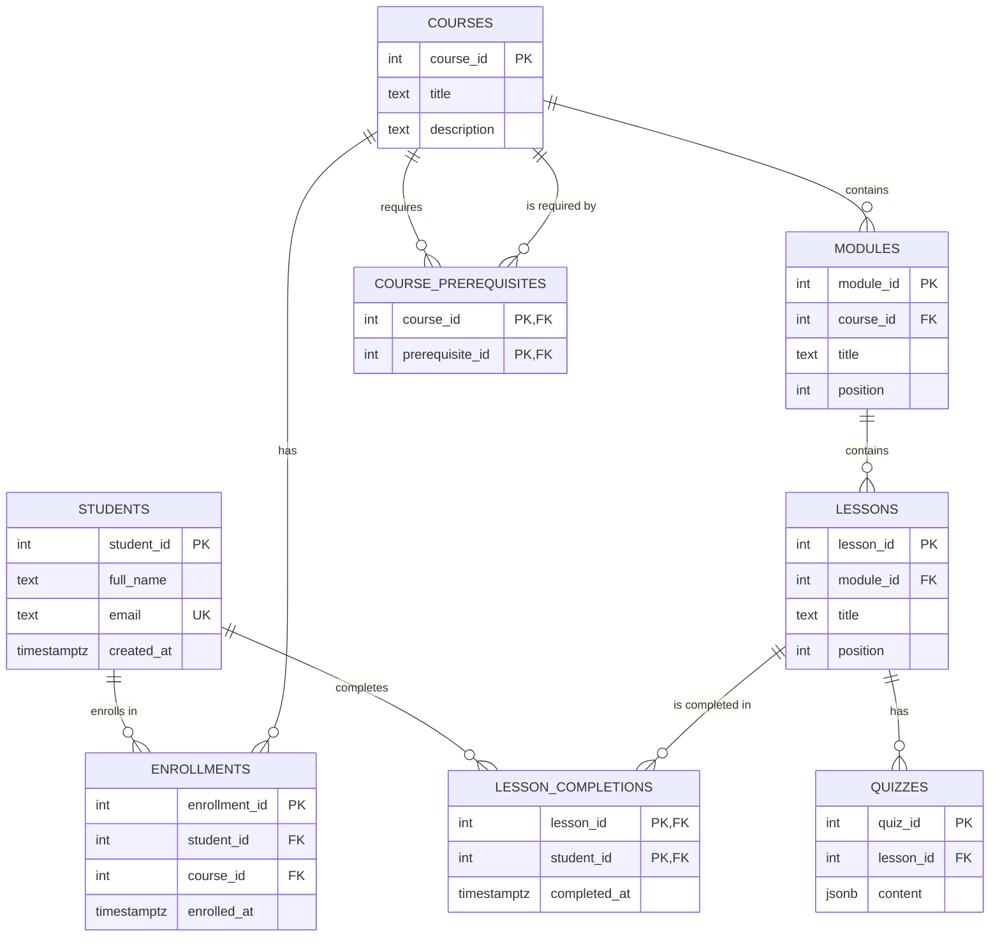

# ER Diagram

```mermaid
erDiagram
    STUDENTS ||--o{ ENROLLMENTS : "enrolls in"
    COURSES ||--o{ ENROLLMENTS : "has"
    COURSES ||--o{ MODULES : "contains"
    MODULES ||--o{ LESSONS : "contains"
    STUDENTS ||--o{ LESSON_COMPLETIONS : "completes"
    LESSONS ||--o{ LESSON_COMPLETIONS : "is completed in"
    COURSES ||--o{ COURSE_PREREQUISITES : "requires"
    COURSES ||--o{ COURSE_PREREQUISITES : "is required by"
    LESSONS ||--o{ QUIZZES : "has"

    STUDENTS {
        int student_id PK
        text full_name
        text email UK
        timestamptz created_at
    }
    COURSES {
        int course_id PK
        text title
        text description
    }
    COURSE_PREREQUISITES {
        int course_id PK, FK
        int prerequisite_id PK, FK
    }
    MODULES {
        int module_id PK
        int course_id FK
        text title
        int position
    }
    LESSONS {
        int lesson_id PK
        int module_id FK
        text title
        int position
    }
    ENROLLMENTS {
        int enrollment_id PK
        int student_id FK
        int course_id FK
        timestamptz enrolled_at
    }
    LESSON_COMPLETIONS {
        int lesson_id PK, FK
        int student_id PK, FK
        timestamptz completed_at
    }
    QUIZZES {
        int quiz_id PK
        int lesson_id FK
        jsonb content
    }
```